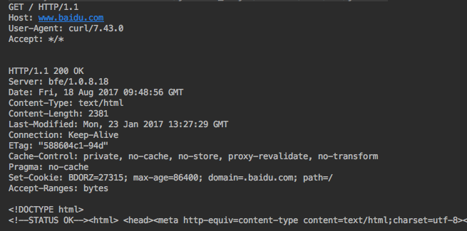

本文转自：https://github.com/jasonGeng88/blog

本文会告诉你如何从计算机网络的基础知识入手，一步步地学习Java网络基础，从socket到bio、nio、aio和netty等网络编程知识，并且进行实战，网络编程是每一个Java后端工程师必须要学习和理解的知识点，进一步来说，你还需要掌握Linux中的网络编程原理，包括IO模型、网络编程框架netty的进阶原理，才能更完整地了解整个Java网络编程的知识体系，形成自己的知识框架。

## 知识点

*   socket 的连接处理
*   IO 输入、输出流的处理
*   请求数据格式处理
*   请求模型优化

## 场景

今天，和大家聊一下 JAVA 中的 socket 通信问题。这里采用最简单的请求一响应模型为例，假设我们现在需要向 baidu 站点进行通信。我们用 JAVA 原生的 socket 该如何实现。

### 建立 socket 连接

首先，我们需要建立 socket 连接（_核心代码_）

```java
import java.net.InetSocketAddress;
import java.net.Socket;
import java.net.SocketAddress;
// 初始化 socket
Socket socket = new Socket();
// 初始化远程连接地址
SocketAddress remote = new InetSocketAddress(host, port);
// 建立连接
socket.connect(remote);
```

### 处理 socket 输入输出流

成功建立 socket 连接后，我们就能获得它的输入输出流，通信的本质是对输入输出流的处理。通过输入流，读取网络连接上传来的数据，通过输出流，将本地的数据传出给远端。

socket 连接实际与处理文件流有点类似，都是在进行 IO 操作。

获取输入、输出流代码如下：

```java
// 输入流
InputStream in = socket.getInputStream();
// 输出流
OutputStream out = socket.getOutputStream();
```


关于 IO 流的处理，我们一般会用相应的包装类来处理 IO 流，如果直接处理的话，我们需要对 `byte[]` 进行操作，而这是相对比较繁琐的。如果采用包装类，我们可以直接以`string`、`int`等类型进行处理，简化了 IO 字节操作。

下面以 `BufferedReader` 与 `PrintWriter` 作为输入输出的包装类进行处理。

```java
// 获取 socket 输入流
private BufferedReader getReader(Socket socket) throws IOException {
    InputStream in = socket.getInputStream();
    return new BufferedReader(new InputStreamReader(in));
}

// 获取 socket 输出流
private PrintWriter getWriter(Socket socket) throws IOException {
    OutputStream out = socket.getOutputStream();
    return new PrintWriter(new OutputStreamWriter(out));
}
```

### 数据请求与响应

有了 socket 连接、IO 输入输出流，下面就该向发送请求数据，以及获取请求的响应结果。

因为有了 IO 包装类的支持，我们可以直接以字符串的格式进行传输，由包装类帮我们将数据装换成相应的字节流。

因为我们与 baidu 站点进行的是 HTTP 访问，所有我们不需要额外定义输出格式。采用标准的 HTTP 传输格式，就能进行请求响应了（_某些特定的 RPC 框架，可能会有自定义的通信格式_）。

请求的数据内容处理如下：


```java
public class HttpUtil {
    public static String compositeRequest(String host){
        return "GET / HTTP/1.1\r\n" +
                "Host: " + host + "\r\n" +
                "User-Agent: curl/7.43.0\r\n" +
                "Accept: */*\r\n\r\n";
    }
}
```

发送请求数据代码如下：

```java
// 发起请求
PrintWriter writer = getWriter(socket);
writer.write(HttpUtil.compositeRequest(host));
writer.flush();
```


接收响应数据代码如下：

```java
// 读取响应
String msg;
BufferedReader reader = getReader(socket);
while ((msg = reader.readLine()) != null){
    System.out.println(msg);
}
```


### 结果展示

至此，讲完了原生 socket 下的创建连接、发送请求与接收响应的所有核心代码。

完整代码如下：

```java
public class SocketHttpClient {

    public void start(String host, int port) {

        // 初始化 socket
        Socket socket = new Socket();

        try {
            // 设置 socket 连接
            SocketAddress remote = new InetSocketAddress(host, port);
            socket.setSoTimeout(5000);
            socket.connect(remote);

            // 发起请求
            PrintWriter writer = getWriter(socket);
            System.out.println(HttpUtil.compositeRequest(host));
            writer.write(HttpUtil.compositeRequest(host));
            writer.flush();

            // 读取响应
            String msg;
            BufferedReader reader = getReader(socket);
            while ((msg = reader.readLine()) != null){
                System.out.println(msg);
            }

        } catch (IOException e) {
            e.printStackTrace();
        } finally {
            try {
                socket.close();
            } catch (IOException e) {
                e.printStackTrace();
            }
        }

    }

    private BufferedReader getReader(Socket socket) throws IOException {
        InputStream in = socket.getInputStream();
        return new BufferedReader(new InputStreamReader(in));
    }

    private PrintWriter getWriter(Socket socket) throws IOException {
        OutputStream out = socket.getOutputStream();
        return new PrintWriter(new OutputStreamWriter(out));
    }
```

下面，我们通过实例化一个客户端，来展示 socket 通信的结果。


```java
public class Application {
    public static void main(String[] args) {
        new SocketHttpClient().start("www.baidu.com", 80);
    }
}
```
结果输出：



## 请求模型优化

这种方式，虽然实现功能没什么问题。但是我们细看，发现在 IO 写入与读取过程，是发生了 IO 阻塞的情况。即：

```java
// 会发生 IO 阻塞
writer.write(HttpUtil.compositeRequest(host));
reader.readLine();
```

所以如果要同时请求10个不同的站点，如下：


```java
public class SingleThreadApplication {
    public static void main(String[] args) {
        // HttpConstant.HOSTS 为 站点集合
        for (String host: HttpConstant.HOSTS) {
            new SocketHttpClient().start(host, HttpConstant.PORT);
        }
    }
}
```
它一定是第一个请求响应结束后，才会发起下一个站点处理。

这在服务端更明显，虽然这里的代码是客户端连接，但是具体的操作和服务端是差不多的。请求只能一个个串行处理，这在响应时间上肯定不能达标。

*   多线程处理

有人觉得这根本不是问题，JAVA 是多线程的编程语言。对于这种情况，采用多线程的模型再合适不过。

```java
public class MultiThreadApplication {
    public static void main(String[] args) {
        for (final String host: HttpConstant.HOSTS) {
            Thread t = new Thread(new Runnable() {
                public void run() {
                    new SocketHttpClient().start(host, HttpConstant.PORT);
                }
            });
            t.start();
        }
    }
}
```

这种方式起初看起来挺有用的，但并发量一大，应用会起很多的线程。都知道，在服务器上，**每一个线程实际都会占据一个文件句柄。而服务器上的句柄数是有限的，而且大量的线程，造成的线程间切换的消耗也会相当的大。**所以这种方式在并发量大的场景下，一定是承载不住的。

*   多线程 + 线程池 处理

既然线程太多不行，那我们控制一下线程创建的数目不就行了。只启动固定的线程数来进行 socket 处理，既利用了多线程的处理，又控制了系统的资源消耗。


```java
public class ThreadPoolApplication {
    public static void main(String[] args) {
        ExecutorService executorService = Executors.newFixedThreadPool(4);
        for (final String host: HttpConstant.HOSTS) {
            Thread t = new Thread(new Runnable() {
                public void run() {
                    new SocketHttpClient().start(host, HttpConstant.PORT);
                }
            });
            executorService.submit(t);
            new SocketHttpClient().start(host, HttpConstant.PORT);
        }
    }
}
```
关于启动的线程数，一般 CPU 密集型会设置在 N+1（N为CPU核数），IO 密集型设置在 2N + 1。

这种方式，看起来是最优的了。那有没有更好的呢，**如果一个线程能同时处理多个 socket 连接，并且在每个 socket 输入输出数据没有准备好的情况下，不进行阻塞，那是不是更优呢。这种技术叫做“IO多路复用”。在 JAVA 的 nio 包中，提供了相应的实现。**

## 补充1：TCP客户端与服务端

```java
public class TCP客户端 {
    public static void main(String[] args) {
        new Thread(new Runnable() {
            @Override
            public void run() {
                try {
                    //构建IO
                    Socket s = new Socket("127.0.0.1",1234);    
                    InputStream is = s.getInputStream();
                    OutputStream os = s.getOutputStream();    
                    BufferedWriter bw = new BufferedWriter(new OutputStreamWriter(os));
                    //向服务器端发送一条消息
                    bw.write("测试客户端和服务器通信，服务器接收到消息返回到客户端\n");
                    bw.flush();    
                    //读取服务器返回的消息
                    BufferedReader br = new BufferedReader(new InputStreamReader(is));
                    String mess = br.readLine();
                    System.out.println("服务器："+mess);
                } catch (UnknownHostException e) {
                    e.printStackTrace();
                } catch (IOException e) {
                    e.printStackTrace();
                }
            }
        }).start();
    }
}
```


```java
public class TCP服务端 {
    public static void main(String[] args) {
        new Thread(new Runnable() {
            @Override
            public void run() {
                try {
                    ServerSocket ss = new ServerSocket(1234);
                    while (true) {
                        System.out.println("启动服务器....");
                        Socket s = ss.accept();
                        System.out.println("客户端:" + s.getInetAddress().getLocalHost() + "已连接到服务器");
                        BufferedReader br = new BufferedReader(new InputStreamReader(s.getInputStream()));
                        //读取客户端发送来的消息
                        String mess = br.readLine();
                        System.out.println("客户端：" + mess);
                        BufferedWriter bw = new BufferedWriter(new OutputStreamWriter(s.getOutputStream()));
                        bw.write(mess + "\n");
                        bw.flush();
                    }
                } catch (IOException e) {
                    e.printStackTrace();
                }
            }
        }).start();
    }
}
```


## 补充2：UDP客户端和服务端

```java
public class UDP客户端 {
    public static void main(String[] args) {
        new Thread(new Runnable() {
            @Override
            public void run() {
                byte []arr = "Hello Server".getBytes();
                try {
                    InetAddress inetAddress = InetAddress.getLocalHost();
                    DatagramSocket datagramSocket = new DatagramSocket();
                    DatagramPacket datagramPacket = new DatagramPacket(arr, arr.length, inetAddress, 1234);
                    datagramSocket.send(datagramPacket);
                    System.out.println("send end");
                } catch (UnknownHostException e) {
                    e.printStackTrace();
                } catch (SocketException e) {
                    e.printStackTrace();
                } catch (IOException e) {
                    e.printStackTrace();
                }
            }
        }).start();
    }
}
```


```java
public class UDP服务端 {
    public static void main(String[] args) {
        new Thread(new Runnable() {
            @Override
            public void run() {
                try {
                    DatagramSocket datagramSocket = new DatagramSocket(1234);
                    byte[] buffer = new byte[1024];
                    DatagramPacket packet = new DatagramPacket(buffer, buffer.length);
                    datagramSocket.receive(packet);
                    System.out.println("server recv");
                    String msg = new String(packet.getData(), "utf-8");
                    System.out.println(msg);
                } catch (SocketException e) {
                    e.printStackTrace();
                } catch (IOException e) {
                    e.printStackTrace();
                }
            }
        }).start();
    }
}
```


## 后续

*   JAVA 中是如何实现 IO多路复用
*   Netty 如何实现异步请求的
